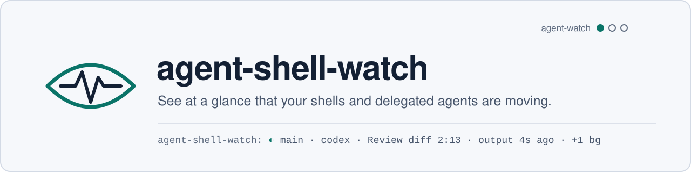
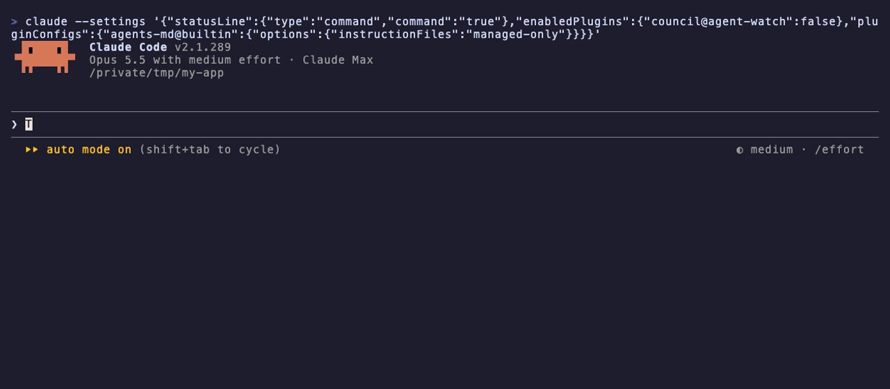

<picture>
  <source media="(prefers-color-scheme: dark)" srcset=".github/assets/banner-dark.svg">
  
</picture>



<sub>Recorded with [vhs](https://github.com/charmbracelet/vhs) from
[`demo/demo.tape`](demo/demo.tape); `codex`, `pi` and `devin` are stand-ins
from `demo/bin` with synthetic sessions and limits, so the recording is free
and repeatable.</sub>

[](https://github.com/apolenkov/agent-shell-watch/actions/workflows/ci.yml)
[](https://github.com/apolenkov/agent-shell-watch/actions/workflows/codeql.yml)
[](https://github.com/apolenkov/agent-shell-watch/releases)
[](LICENSE)
[](https://claude.com/claude-code)
[](https://scorecard.dev/viewer/?uri=github.com/apolenkov/agent-shell-watch)

A [Claude Code](https://claude.com/claude-code) mod that watches this
session's Bash calls (main loop and every subagent), background tasks and,
above all, the agent runs you delegate through the shell: Codex, Pi, Devin and
OpenCodeReview (`ocr`).

## Why

- A delegated agent run in a background shell is a black box: you cannot tell
  a long review from a hung one without opening its log.
- Failures in background calls scroll past unnoticed until the model trips
  over them.
- A delegated agent that hit its rate limit or stalled says so only in a log
  you have to go and read.

agent-shell-watch shows at a glance that the work is moving: time ticking,
output fresh, nothing failed.

## Features

- 📟 **Status line** while anything runs, or a call failed in the last
  2 minutes: the most urgent call leads, the rest are counted.
- 🪟 **`/shell-watch` pane**, grouped by who made the calls (`main` and each
  subagent), with every call's state, command and last output line.
- 🏃 **Runners recognised**: `codex`, `pi`, `devin`, `ocr`, with their live
  output file and their guard verdict (`DONE`, `RATE_LIMIT`, `STALLED`, `BUSY`).
- ⚠️ **Quiet and hung**: a running call without new output for `quietMin` /
  `hangMin` minutes is flagged.
- ⏹️ **Stop button** for the running background call, through `TaskStop`.
- ⌨️ **Keyboard first**: every button shows its key; the pane remembers
  across sessions whether you left it open.

## Install

This repository is its own marketplace:

```
/plugin marketplace add apolenkov/agent-shell-watch
/plugin install agent-shell-watch@agent-shell-watch
```

It is also listed, with its sibling mods, in the
[agent-mods](https://github.com/apolenkov/agent-mods) marketplace:

```
/plugin marketplace add apolenkov/agent-mods
/plugin install agent-shell-watch@agent-mods
```

Requirements: Claude Code 2.1.287 or later (mods are on by default), and
`tail` on `PATH`.

## Usage

### Status line

Shown while anything runs, or a call failed in the last 2 minutes. The most
urgent call leads (hung, failed, quiet, running; a runner before a plain
shell), the rest are counted as `+N hung`, `+N failed`, `+N quiet`, `+N bg`,
`+N running`. The leading call says whose it is: `main` or the subagent's
type. Claude Code labels the line with the plugin's name:

```
agent-shell-watch: ◐ main · codex · Review diff 2:13 · output 4s ago · › applying patch src/a.ts · +1 bg
agent-shell-watch: ⚠ quiet 6m pi-runner · pi · Fix flaky test 7:40 · +2 running
agent-shell-watch: ◐ main · Wait 0:45 · no output · 45s
agent-shell-watch: ⚠ hung 12m main · Wait loop · +1 failed
agent-shell-watch: ✗ main · Typecheck exit 2 · +1 bg
agent-shell-watch: ✗ general-purpose · devin · Review spec RATE_LIMIT 1790000000
```

### The pane

```
[ f fold ] [ c clear ] [ q close ]
[ 1 ▾ ] ⚠ main · 3 calls · 1 live
[ 2 ▸ ] ⚠ 9:12 hung · no output · 9m  Wait loop  [ s stop ]
        bg · sleep 3600
[ 3 ▸ ] ● 0:01 exit 0  List files
        ls -1 | head -3
        › README.md
[ 4 ▾ ] ✗ general-purpose: Review spec · 2 calls
[ 5 ▸ ] ✗ 0:03 RATE_LIMIT 1790000000  devin · Review spec
        devin -p 'review the spec' 2>&1 | tee /tmp/d.log
        ✗ RATE_LIMIT 1790000000
[ 6 ▸ ] ● Explore: Find callers · 4 calls · › 12 matches
1–9 open · f fold · c clear · q close · Esc → prompt
```

Calls are grouped by who made them: `main` (this session's own loop) and
each subagent (`type: description`; one started by another subagent ends
`↳ <its parent>`). A runner is a row in the group of the agent that ran it.
Each group's header carries its rollup: the worst live call (hung, quiet,
running), a failure in the last 2 minutes, the agent's own status (`✗` when
it failed), or a dim `◌ idle` for an agent at rest. The most urgent group
comes first; finished groups start folded, and a folded header shows its
leading call's last line.

Inside a group, live calls come first, then failures, finished calls and
denied ones, the newest first in each; what does not fit the pane's height
becomes a dim `+N older` line. Opened above the prompt, the pane asks for the
rows it needs (6 to 30); short of room, rows shrink to one line, but a
running runner keeps its last output line. A row is its state before the
label (a narrow pane cuts the label, never the time or outcome), its command
(`bg ·` for a background one), and its last output line (a failure's last
error in red, a denial's reason, dim).

| Command / key          | What it does                                                                                                         |
| ---------------------- | -------------------------------------------------------------------------------------------------------------------- |
| `/shell-watch`         | Opens the pane and gives it the keyboard (refocuses it if already open)                                              |
| `/shell-watch runners` | Shows only the external agent CLIs (Pi, Devin, Codex), flat: the verdict and who started each one                    |
| `/shell-watch agents`  | Back to the calls grouped by agent (`groups` works too); a bare `/shell-watch` keeps the view you left               |
| `/shell-watch clear`   | Forgets finished calls                                                                                               |
| `/shell-watch stop`    | Closes the pane                                                                                                      |
| `1`–`9`                | Folds or opens a group (on its header) or expands a row: full command, last 40 lines, stderr, output and watch files |
| `f`                    | Folds every group, or opens them all when all are folded                                                             |
| `r`                    | Flips between the agents view and the runners view                                                                   |
| `c`                    | Clears finished calls                                                                                                |
| `s`                    | Stops the running background call (when there is one) with `TaskStop`                                                |
| `q`                    | Closes the pane                                                                                                      |
| Tab / Enter            | Walks the buttons / presses one                                                                                      |
| Esc                    | Hands the keys back to the prompt; the pane stays                                                                    |

The first line's `[ 1 ▾ ]` holds the focus.

### Runners view

`/shell-watch runners` (or `r`) drops the groups and lists only the calls of
Pi, Devin, Codex and `ocr`, most urgent first: a summary line
(`runners · N · k live · f failed`), then one row per run with its verdict
(`DONE 0`, `RATE_LIMIT …`, `WAITING …`, `FAILED …`, from the runner guard) and, after its label, who started it (`← main`, `← general-purpose: review spec`). Rows expand and stop as in the agents view. The view is remembered
between sessions.

Under the summary a `limits:` line says whether each executor has room
(`limits: devin ok · pi ok · codex 100% until Sat 16:48`). It reads
`~/.local/state/executor-limits/<name>` (one epoch in seconds) and, for Codex,
the end of the newest rollout in `~/.codex/sessions` (`token_count`'s
`rate_limits.primary`): an executor is blocked while its epoch is ahead, or
Codex is at 100% with the window's reset ahead. Damaged or missing data reads
as ok. The files are read only while the runners view is open or a runner is
live, at most every 30 s; the status line adds `⏳ codex limit` while a block
is active.

After `← main` a row says what the run spent (`← main · 23k tok · $0.002`). The
numbers come from the run's own session file, found by the start time in its
name (the call's cwd is unknown): Pi sums `message.usage` over the last 256 KiB
of `~/.pi/agent/sessions` (tokens and dollars; `≥` when the file is larger),
Codex shows `total_tokens` of the last `token_count` in `~/.codex/sessions`
(cached input included, no cost). Devin keeps no usage, and a run whose file is
not the only Pi one started in its window (parallel runners) is `—` too; with several Codex rollouts in the window the one started nearest to the call is taken. They are
read only while the runners view is open, for the rows shown, at most every
30 s per run; a narrow pane drops them before it cuts `by`.

### Glyphs

| Glyph        | Meaning                                                                                                                                                       |
| ------------ | ------------------------------------------------------------------------------------------------------------------------------------------------------------- |
| `◐`          | running                                                                                                                                                       |
| `●`          | done                                                                                                                                                          |
| `✗`          | failed                                                                                                                                                        |
| `⚠`          | quiet or hung                                                                                                                                                 |
| `○`          | stopped                                                                                                                                                       |
| `○ denied`   | (dim) refused before it ran (a permission rule, a hook, you); never reaches the status line                                                                   |
| `○ no match` | (dim) a search or test (`grep`, `rg`, `ag`, `ack`, `git grep`, `diff`, `test`/`[`, `cmp`, `pgrep`) ended a command with exit 1; never reaches the status line |
| `—`          | the time of a call rebuilt from the transcript without a duration                                                                                             |

A runner's outcome is its guard verdict (`DONE n`, `RATE_LIMIT epoch`,
`STALLED reason`, `BUSY pid file`), else the exit code.

## Configuration

Set in `/config`.

| Option        | Default | Meaning                                                   |
| ------------- | ------- | --------------------------------------------------------- |
| `columns`     | 52      | Width asked for the docked pane                           |
| `openOnStart` | false   | Open the pane at start until you have opened or closed it |
| `maxCalls`    | 50      | Calls kept, the oldest finished dropped first             |
| `quietMin`    | 5       | Minutes without new output before a running call is quiet |
| `hangMin`     | 10      | Minutes without new output before a running call is hung  |
| `statusLine`  | true    | Show the status line                                      |

<details>
<summary><b>How it works</b></summary>

| Event / timer             | What agent-shell-watch does                                                                   |
| ------------------------- | --------------------------------------------------------------------------------------------- |
| `session.start`           | Registers `/shell-watch`, rebuilds calls made before the mod loaded, starts the tick and poll |
| `tool.call` (Bash)        | Records the call (label from the input `description`), awaits it, records exit and output     |
| `session.append`          | A `<task-notification>` row settles its background call (status, exit code)                   |
| tick, every 1 s           | Advances elapsed time and redraws the status line                                             |
| poll, every 2 s           | `fs.stat` of the watch or output file → freshness, quiet, hung; `tail -n 40` for runner rows  |
| `ui.render` (Pane)        | Draws the pane; the selected row's tail is read once when it is selected                      |
| `ui.open`                 | Rebuilds missed calls from `$.session.messages()` (main loop and running agents)              |
| `ui.close`, `command.run` | Opens and closes the pane; the choice is kept in `$.store` for the next session               |

A runner is a command whose executable (past `NAME=value` and `cd … &&`,
after a guard's `--`, or inside `bash -c '…'` / `sh -c "…"`) is `codex`,
`pi`, `devin` or `ocr`. Its live output is the guard's `--watch-file`, its
`| tee [-a] /path`, or its absolute stdout redirect (`> /path/run.log`); with
no description its label is the first words of its prompt. The verdict is
read from the Bash output once the run ends. agent-shell-watch sees the
command as the model wrote it, before a `PreToolUse` settings hook wraps it,
and recognises both forms. A `TaskStop` (the model's or the pane's) settles
its call as stopped; an interrupted call is stopped, not failed. Every hook
passes its event on unchanged.

</details>

## Privacy

No network, no telemetry. It reads only this session's transcript and the
output and watch files of its own Bash calls, keeps its list in the session's
memory, and stores one value across sessions: whether the pane was left open.
See [SECURITY.md](SECURITY.md).

## Development

See [CONTRIBUTING.md](CONTRIBUTING.md): `npm ci`, then `npm run check`; try it
live with `claude --plugin-dir .`. Releases are cut by release-please; the
history before 0.2.0 comes from
[agent-mods](https://github.com/apolenkov/agent-mods). Questions:
[SUPPORT.md](SUPPORT.md).

## License

[MIT](LICENSE). `engine-types/claude-code.d.ts` is © Anthropic PBC and not
covered by the MIT license; see [engine-types/NOTICE.md](engine-types/NOTICE.md).
